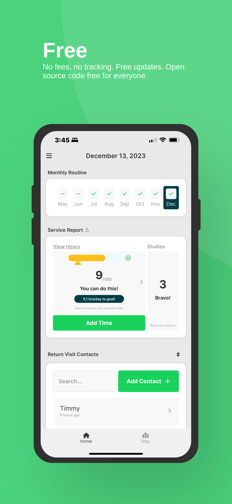
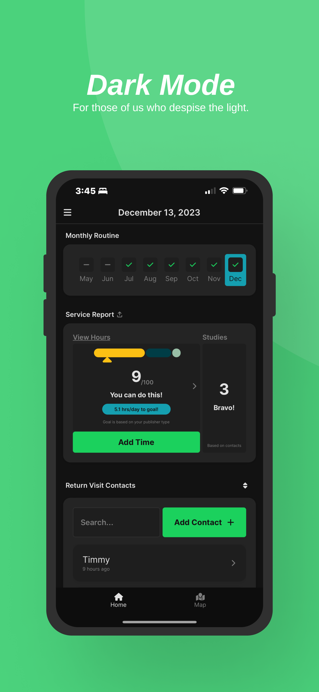
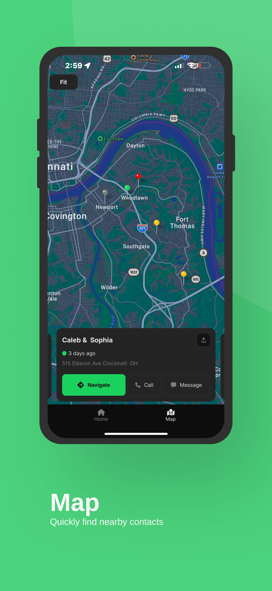
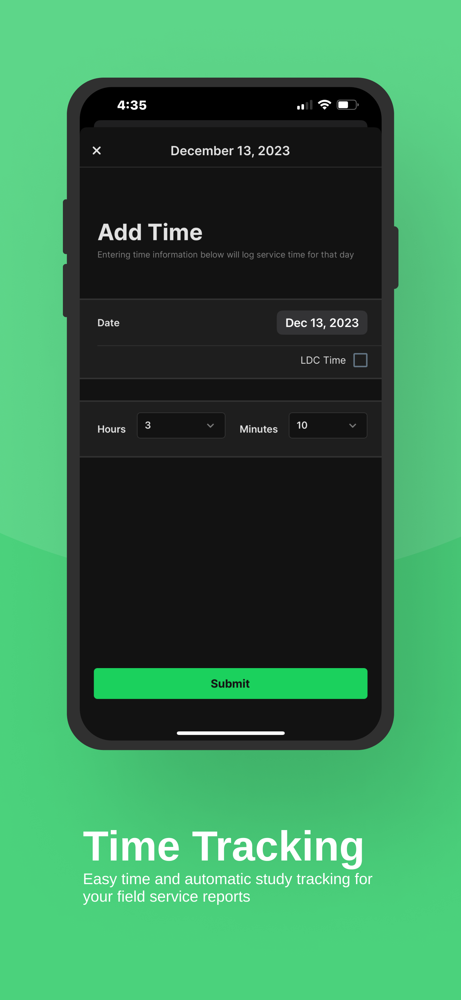
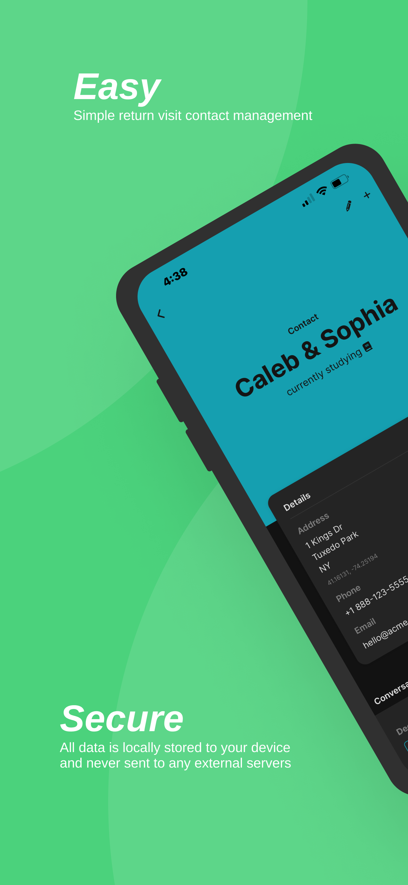
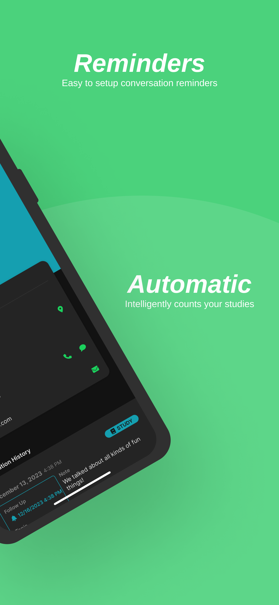

# JW Time

JW Time is the easy way for Jehovah's Witnesses to manage their field service priorities.

## View it live

### Preview

## Want to Contribute?

### Help Translate 🌐

JW Time is automatically translated into 11 languages by means of Google Cloud Translate. These translations might not always be the highest quality. To help, proofread these translations on [Crowdin](https://crowdin.com/project/jw-time/). Thank you!

[Not sure how to use Crowdin?](https://support.crowdin.com/enterprise/getting-started-for-translators/)

Current translations: de, es, fr, it, ja, ko, nl, pt, ru, vi, zh

### Help Code ⌨️

Any assistance is welcome! Look at the following and see if anything looks interesting to you:

1. [Open issues](https://github.com/leviFrosty/JW-Time/issues)
2. [Project board](https://github.com/users/leviFrosty/projects/2)

If you find something you'd like to help with, please let me know you've began work on it so it doesn't become double-worked. Thank you!

### Help Financially 💖

Donations are never expected but greatly appreciated! These donations are used to offset the costs of:

- [App Store Fees](https://developer.apple.com/support/compare-memberships/#:~:text=**%20The%20Apple%20Developer%20Program%20is%2099%20USD%20per%20membership%20year%20or%20in%20local%20currency%20where%20available.%20Your%20nonprofit%2C%20educational%20institution%2C%20or%20government%20entity%20may%20be%20eligible%20for%20a%20fee%20waiver.) ($100/yr)
- [Here API Calls](https://www.here.com/platform/geocoding) (Currently $0/mo)
- [Google Cloud Translation](https://cloud.google.com/translate/pricing) (<$5/mo)

These expenses are kept up to date here. Thank you!

## License

JW Time © 2023 by Levi Wilkerson is licensed under [Attribution-NonCommercial 4.0 International](./LICENSE)
