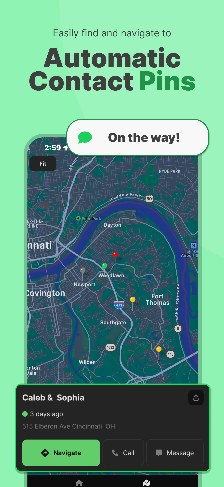
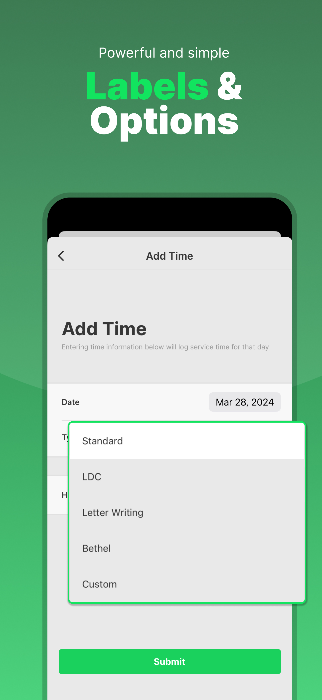

# JW Time

JW Time is the easy way for Jehovah's Witnesses to manage their field service priorities.

## View it live

### Preview

## Help Translate 🌐

JW Time is automatically translated into 12 languages by means of Google Cloud Translate. These translations might not always be the highest quality. To help, proofread these translations on [Crowdin](https://crowdin.com/project/jw-time/). Thank you!

[Not sure how to use Crowdin?](https://support.crowdin.com/crowdin-intro/)

Current translations:

1. German
1. Spanish
1. French
1. Italian
1. Japanese
1. Korean
1. Dutch
1. Portuguese
1. Russian
1. Vietnamese
1. Chinese
1. Tagalog

## Help Code ⌨️

Any assistance is welcome! Look at the following and see if anything looks interesting to you:

1. [Open issues](https://github.com/leviFrosty/JW-Time/issues)
2. [Project board](https://github.com/users/leviFrosty/projects/2)

If you find something you'd like to help with, please let me know you've began work on it so it doesn't become double-worked. Thank you!

#### Environment

To start the Expo Dev server, begin with `yarn install` & `yarn run dev`.

> **Note**: Local environment variables set in [`./package.json`](./package.json) scripts rely on a unix based environment variable assignments. If your system is Windows, try using [WSL](https://learn.microsoft.com/en-us/windows/wsl/install) to start development of this project.

You must use a [development build](https://docs.expo.dev/develop/development-builds/introduction/), not [Expo Go](https://docs.expo.dev/get-started/expo-go/).

In order to get a development build, you can compile the application with [EAS](https://docs.expo.dev/eas/) `eas build -p [ios/android] --profile development --local`.

After that, open the compiled development build in your simulator/device and connect to the local Expo Dev Server.

🎉 You did it! _(Hopefully)_

### Project Structure

- [`.github`](/.github) Configuration files for Github actions.
- [`.husky`](/.husky) Configuration files for [husky](https://typicode.github.io/husky/), a git hooks library.
- [`.tamagui`](/.tamagui) Configuration files for [tamagui](https://tamagui.dev/), a component library used in only portions of the project.
- [`.vscode`](/.vscode) VSCode configuration files for extensions.
- [`App.tsx`](/App.tsx) Application entry point.
- [**`src`**](/src) This is where all of the project source code lives.

  - [`__tests__`](/src/__tests__) Where all of the tests for the project lives.
  - [`assets`](/src/assets) Where local assets such a images, icons, and [lottie](https://lottiefiles.com/) animations are stored.
  - [`components`](/src/components) All of the components of the project.
  - [`constants`](/src/constants) Variables that are constant throughout the app and do not change.
  - [`contexts`](/src/contexts) Stores the internal [React Contexts](https://react.dev/learn/passing-data-deeply-with-context).
  - [`docs`](/src/docs) The documentation and related assets for this repository.
  - [`hooks`](/src/hooks) Contains the custom [React Hooks](https://react.dev/learn/reusing-logic-with-custom-hooks#hook-names-always-start-with-use) for this project.
  - [`lib`](/src/lib) Contains many functions that are useful for app functionality. Generally, shared functions should come from a `lib` instead of directly from a `component`.
  - [`locales`](/src/locales) The translations files for each locale - `en` is the master.
  - [`providers`](/src/providers) The [React Providers](https://react.dev/reference/react/createContext#provider) for the [`contexts`](/src/contexts).
  - [`screens`](/src/screens) Contains all [screens](https://reactnative.dev/docs/navigation) that the app can display.
  - [`scripts`](/src/scripts) Local CLI scripts for various CI/CD functions.
  - [`stacks`](/src/stacks) All [native stacks](https://reactnavigation.org/docs/native-stack-navigator) of used for [React Native Navigation](https://reactnavigation.org/).
  - [`stores`](/src/stores) The [AsyncStorage](https://github.com/react-native-async-storage/async-storage) APIs for CRUD operations of app data using the device's storage.
  - [`types`](/src/types) Shared type definitions.

### [.env Keys](./.env)

- `GOOGLE_CLOUD_API_KEY` Used for cloud translation API calls in CLI
- `HERE_API_KEY` Used for geocoding api calls when users create address to fetch coordinates
- `GOOGLE_MAPS_ANDROID_SDK_API_KEY` [Android] Maps SDK Api allows use of Google Maps within application
- `REVENUECAT_APPLE_API_KEY` [iOS] Allows use of revenuecat service for in-app purchases for donations
- `SENTRY_AUTH_TOKEN` Token that enables Sentry application error logging
- `EXPO_PUBLIC_SENTRY_PROJECT` Configuration for sentry's project
- `EXPO_PUBLIC_SENTRY_ORG` Configuration for sentry's organization
- `APP_VARIANT` Set to `development` when working locally, targets the eas build to create the `JW Time Dev` bundle instead of production `JW Time`

## Help Financially 💖

Donations are never expected but greatly appreciated! These donations are used to offset the costs of:

- [App Store Fees](https://developer.apple.com/support/compare-memberships/#:~:text=**%20The%20Apple%20Developer%20Program%20is%2099%20USD%20per%20membership%20year%20or%20in%20local%20currency%20where%20available.%20Your%20nonprofit%2C%20educational%20institution%2C%20or%20government%20entity%20may%20be%20eligible%20for%20a%20fee%20waiver.) ($100/yr)
- [Here API Calls](https://www.here.com/platform/geocoding) (Currently $0/mo)
- [Google Cloud Translation](https://cloud.google.com/translate/pricing) (<$5/mo)

These expenses are kept up to date here. Thank you!

You may wish to donate in the app by pressing on the heart icon or more directly at Ko-Fi, without Apple's 30% cut, below:

## License

JW Time © 2024 by Levi Wilkerson is licensed under [Attribution-NonCommercial 4.0 International](./LICENSE)
