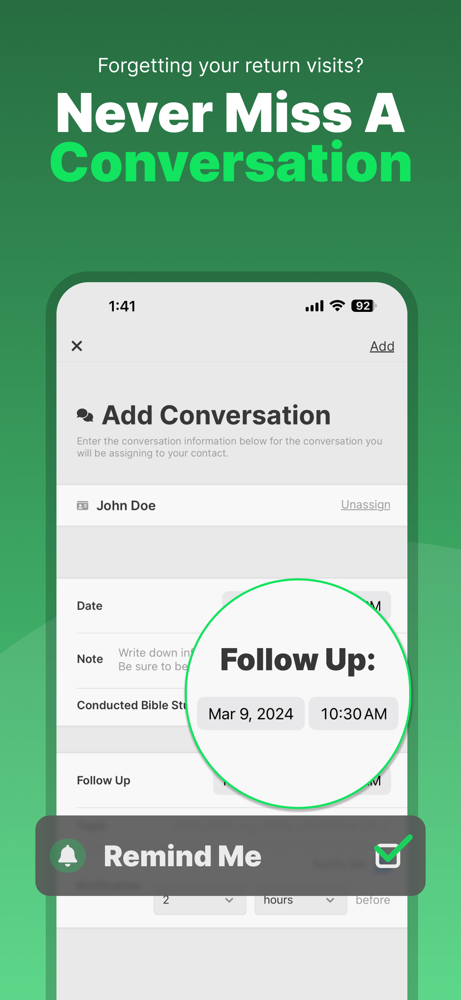
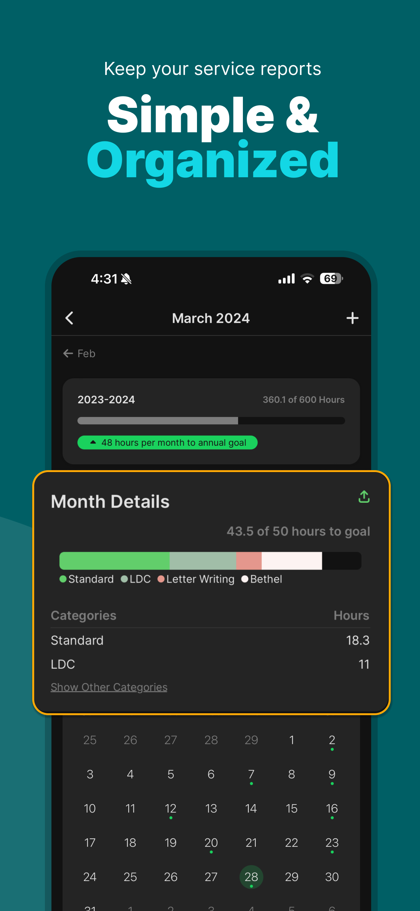
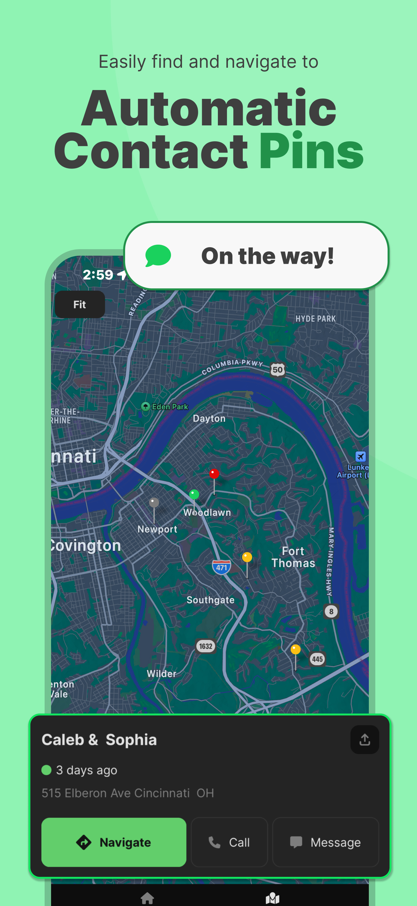
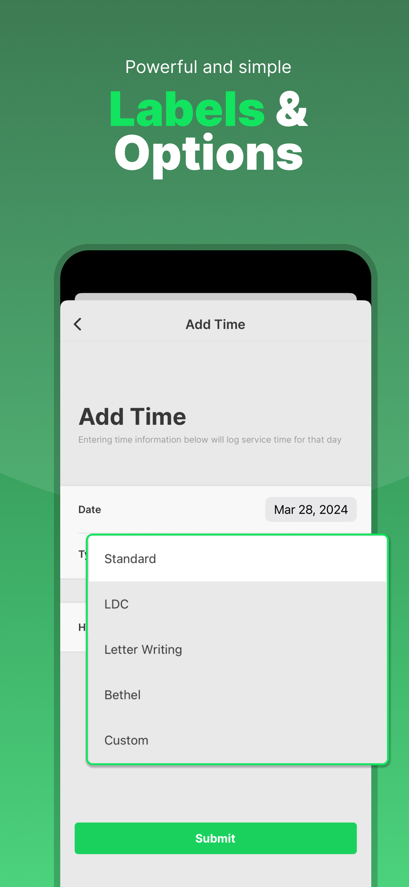
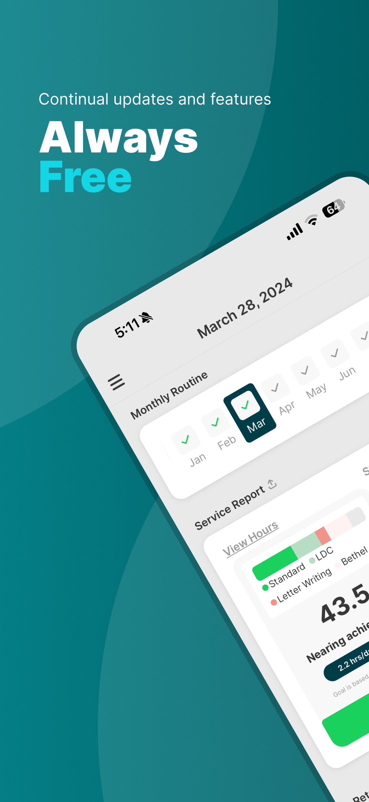
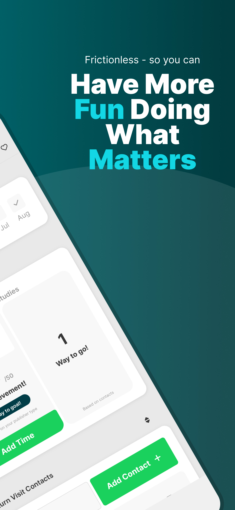

# WitnessWork

WitnessWork is the easy way for Jehovah's Witnesses to manage their field service priorities.

It is written in Typescript using React Native and Expo and is available on iOS.

## Sponsor

Please consider donating if you have found WitnessWork helpful to you in your service & you have the means.

## Looking for maintainers

Due to my increased time constraints volunteering, my day job, family, etc., I'm looking for someone to take the lead in bug fixes + future development on this project for the foreseeable future. Please contact me at <levi@leviwilkerson.com>.

## View it live

## Help Translate 🌐

WitnessWork is available in 16 languages. Some of these translations are done by AI, which may not be of the highest quality. To help, proofread these translations on [Crowdin](https://crowdin.com/project/jw-time/). Thank you!

[Not sure how to use Crowdin?](https://support.crowdin.com/crowdin-intro/)

## Building

Development setup and the production build process are documented in [docs/build.md](./docs/build.md). Production builds are intentionally done **locally** (`pnpm run build:prod-auto-submit`) rather than on EAS Build cloud services.

## License

WitnessWork © 2023-2026 by Levi Wilkerson is licensed under [Attribution-NonCommercial 4.0 International](./LICENSE)
