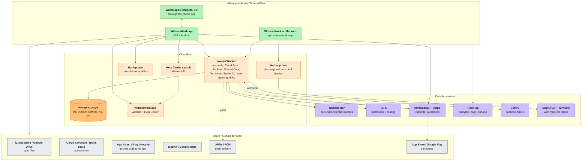

# WitnessWork

WitnessWork is the easy way for Jehovah's Witnesses to manage their field service priorities.

It's available on iOS, Android, and the web, built in TypeScript with React Native and Expo.

## Sponsor

Please consider donating if you have found WitnessWork helpful to you in your service & you have the means.

## View it live

## Languages 🌐

WitnessWork is available in 19 languages, translated with AI, including Arabic with a right-to-left layout. If a translation looks wrong, please [open an issue](https://github.com/leviFrosty/witness-work/issues/new) with the language, the screen, and the correct wording. Thank you!

## Building

Development setup (iOS and Android) and the production build process are documented in [docs/build.md](./docs/build.md). Production builds are intentionally done **locally** (`pnpm run build:prod-auto-submit`) rather than on EAS Build cloud services.

## Architecture

How the app, its backend [ww-api](https://github.com/leviFrosty/ww-api), and the services they use connect. Arrows point from the caller to what it calls; dashed arrows are pushes and background work.

[Open the diagram in Mermaid Live](https://mermaid.live/view#pako:eNp9VW1v2zYQ_isH9cuW0EkapGtiDAVkRZ29vFiQ1LpFNCSUdLI4y6RAUva8tv99oKjY0tIW-qI78nl4Lw95X5xM5OiMnaIS26ykUkM8STiAatKlpHUJ3u3Mv4-jh8RZlCgRahR1hdAohAXTHJVaCLlKnL8MCsANgofEeTo66i0Creujo4SzeQTH4PJcCpY_7SELf_ISIjjoEmGLqUHSuj7Z2tWtkKsTWtcHvP8pDt2oo6A6K815isCW5UvUikDEJDMsupSiWZYtcV0KjtDjQZ4nfJB5cOvG7-fh3UPiuLXJ-RT-EGJZISiUG5ah2ocQPEaf7z0bAvMq0eRwLdmmB2lNE4Ta8QwKVqF66sFv_M_RAH6Du6ykjMMpTCqRrSDSQrYENMtEwzWscNdncOPYj2LL4dY1uFqj0nAKQUV3MOMal5LpnWGopdigAgpL5A0blsFQ3blBF8wdrW-YPmRxR2t1dNTfG3yIpt2hwb2CU3jv3bVnNKqEHCu2QTmIM4rnoX8Is03rcIAJ1sJlVlJ1KNLL9njvHxKnLVZRUYk9Bc4s_XY7ojUDIyeUvcopArbG0Y5nBCZNnjM0MimpxBw8KhVJeIxSMi2kXcokSxHcGQEpGo1QV5RzxpcEKsZXvVZeu7H78Ev_fKWFpMu2ddevCVw3kqYVwjz9GzMTS3hO4ObjU-L82lHMY9cmMBUaPtQ51TZ8sUE50iWOKJPQtH41uEXT-bMAFpiapkIplG7LWTUK1rQGynNIhR5lJWYrKCRd9zmiWdy15n-XzXBsMVVMIxzDFKsaPOQaZQ_ru6HXSaG3ARRSmZWGwDZCgTv7cVP9T7Ef3ru3D4kzb7Ri-XcuW_R4e3tnD5rXyEPTkLZA_6IUo5xqOpKokWsmOKxFjlU_xcep_6w_89fqIs8lKoUKjtv2Mr7sA8LuYoe4Qd6gRzUcQ6Qlq9umRk1dC2lSfSFagw66mgRC6alYtudxWu00yxSBoqJLRUA1coO7AS7y7-Pws8VGyLVs70VKsxXyHFBKIQf7F_4k-ugNru2f5rmNG8mVZhV2PTQyIEYD0GrgRSvsawq_j0bvzGNuXG4QgDVnxlz4k--ZnQD7gHns9k0jr4HdSsZ47B-MTr6z6_kZNr5uGFn0YzAdsD2GXhePiaPz2bLYfbPWZ25o327lNHQYYQw9oTe0bXf2vpPRu6-JY968xPnavYptXo-hZ5Ow797BZxFbTEshVgbUVtOsZxVV6hoLyCqGXJtZUY1fpefFeZoSpaVY4fjVeXGFFxckE5WQ41ev0XwDcF1RXQi57uB4hRkWe_jF1ZuzN29_At-2d7UDFwVeZtkejJdvrs6yn4CVphr32Ozs7eUem19dXJ4VP8HiPxolp1UHz8_SojjE_dvbi9f51Q_gRglk4U9IJ2Fbv8OyHdLEDlvyPDGJnXfENo10jdrXr88-I_PYJZ2-iNEp6YRry3XYazRmy3DwtTojVlzEiIAYBZNnLZFnre5LkHCHOGuUa8pyZ-x8SRxd4hoTZ5w4ORa0qXTifHOIQxstzCxzxlo2SBw7G64ZXUq6ts5v_wHnAyjq) to zoom and pan.

```mermaid
flowchart TB
  subgraph CLIENTS["Where people use WitnessWork"]
    APP["`**WitnessWork app**
iOS + Android`"]
    WEB["`**WitnessWork on the web**
app.witnesswork.app`"]
    EXTRAS["`**Watch apps, widgets, Siri**
through the phone app`"]
  end

  subgraph PLATFORM["Apple / Google services"]
    P_SYNC["`**iCloud Drive / Google Drive**
sync files`"]
    P_KEYS["`**iCloud Keychain / Block Store**
account key`"]
    P_ATTEST["`**App Attest / Play Integrity**
proves a genuine app`"]
    P_MAPS["`**MapKit / Google Maps**`"]
    P_PUSH["`**APNs / FCM**
push delivery`"]
    P_STORE["`**App Store / Google Play**
purchases`"]
  end

  subgraph CF["Cloudflare"]
    API["`**ww-api Worker**
accounts, Cloud Sync, Buddies, Shared Cars,
Territories, Scribe AI, route planning, links`"]
    DATA[("`**ww-api storage**
D1, Durable Objects, R2, KV`")]
    OTA["`**Hot Updater**
over-the-air updates`"]
    WEBHOST["`**Web app host**
plus map and bot-check frames`"]
    SITE["`**witnesswork.app**
website + Help Center`"]
    SEARCH["`**Help Center search**
Workers AI`"]
  end

  subgraph EXTERNAL["Outside services"]
    S_LLM["`**OpenRouter**
zero-data-retention models`"]
    S_HERE["`**HERE**
addresses + routing`"]
    S_RC["`**RevenueCat + Stripe**
Supporter purchases`"]
    S_PH["`**PostHog**
analytics, flags, surveys`"]
    S_SENTRY["`**Sentry**
backend errors`"]
    S_WEBSVC["`**MapKit JS + Turnstile**
web map, bot check`"]
  end

  EXTRAS <--> APP
  APP --> API
  WEB --> API
  WEB --> WEBHOST
  APP --> OTA
  APP --> SITE
  APP --> SEARCH
  SEARCH -.-> SITE
  APP --> PLATFORM
  CLIENTS --> S_PH
  APP --> S_RC
  WEBHOST --> S_WEBSVC
  API --> DATA
  API --> S_LLM
  API --> S_HERE
  API --> S_RC
  API --> S_SENTRY
  API -.->|"push"| P_PUSH
  S_RC --> P_STORE
  S_RC -.->|"webhook"| API

  classDef client fill:#b2f2bb,stroke:#2f9e44,color:#1e1e1e
  classDef platform fill:#e9ecef,stroke:#495057,color:#1e1e1e
  classDef worker fill:#ffe8cc,stroke:#e8590c,color:#1e1e1e
  classDef state fill:#ffc078,stroke:#d9480f,color:#1e1e1e
  classDef external fill:#d0bfff,stroke:#6741d9,color:#1e1e1e
  class APP,WEB,EXTRAS client
  class P_SYNC,P_KEYS,P_ATTEST,P_MAPS,P_PUSH,P_STORE platform
  class API,OTA,WEBHOST,SITE,SEARCH worker
  class DATA state
  class S_LLM,S_HERE,S_RC,S_PH,S_SENTRY,S_WEBSVC external
```

## License

WitnessWork © 2023-2026 by Levi Wilkerson is licensed under [Attribution-NonCommercial 4.0 International](./LICENSE)
